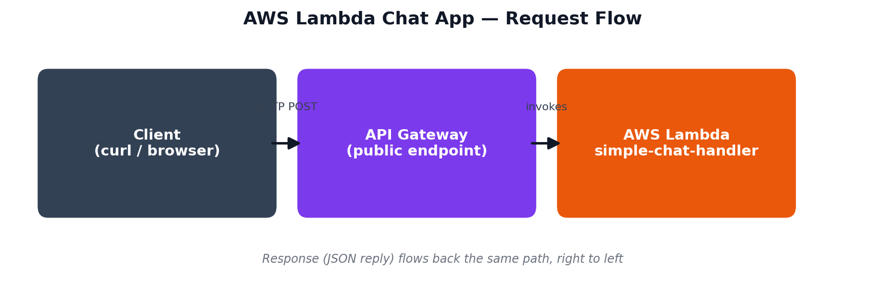

# Level - 3 CLCY

# Task 1: AWS Lambda — Task Report

**Course:** Cloud Computing
**Student:** Syed
**Function Name:** `simple-chat-handler`
**Region:** us-east-1 (N. Virginia)

---

## Objective

Deploy a simple chat application using AWS Lambda to understand how event-driven, serverless (Function as a Service) computing works — running code that responds to requests without provisioning or managing any server.

---

## Description

AWS Lambda runs code only when triggered by an event (like an HTTP request), automatically managing all compute resources behind the scenes. It's like a food truck that appears only when an order comes in, cooks it, and disappears — you pay only for that moment of execution, not for idle time like a traditional always-on server.

For this task, a Python function was written, deployed to Lambda, connected to a public URL via API Gateway, and tested both inside the AWS console and from an external terminal using `curl`.

---

## Architecture


`Client → API Gateway (public endpoint) → Lambda function → JSON response back`

---

## Key Points

- **Serverless & event-driven** — the function only runs when triggered; no server is provisioned or kept running.
- **Function:** `lambda_handler(event, context)` parses an incoming JSON message and returns a matching reply (`hello`, `bye`, or an echo fallback).
- **Deployment issue faced:** an initial test returned the default placeholder response because code was saved but not yet *deployed*. Clicking **Deploy** published the live version and fixed it.
- **Trigger added:** API Gateway (HTTP API, Open security) — generated a public endpoint:
  `https://cjauzbbkz5.execute-api.us-east-1.amazonaws.com/default/simple-chat-handler`
- **Verified twice:**
  - Internally via a Lambda test event → returned correct JSON reply.
  - Externally via `curl` from a local terminal → returned `{"reply": "Hi there! How can I help you today?"}`.
- **Security note:** the endpoint is currently Open (no auth) — fine for coursework, but would need an API key or IAM auth for production use.

---

## Function Code

```python
import json

def lambda_handler(event, context):
    body = json.loads(event.get('body', '{}'))
    user_message = body.get('message', '')

    if 'hello' in user_message.lower():
        reply = "Hi there! How can I help you today?"
    elif 'bye' in user_message.lower():
        reply = "Goodbye! Have a great day."
    else:
        reply = f"You said: {user_message}"

    return {
        'statusCode': 200,
        'headers': {'Content-Type': 'application/json'},
        'body': json.dumps({'reply': reply})
    }
```

---

